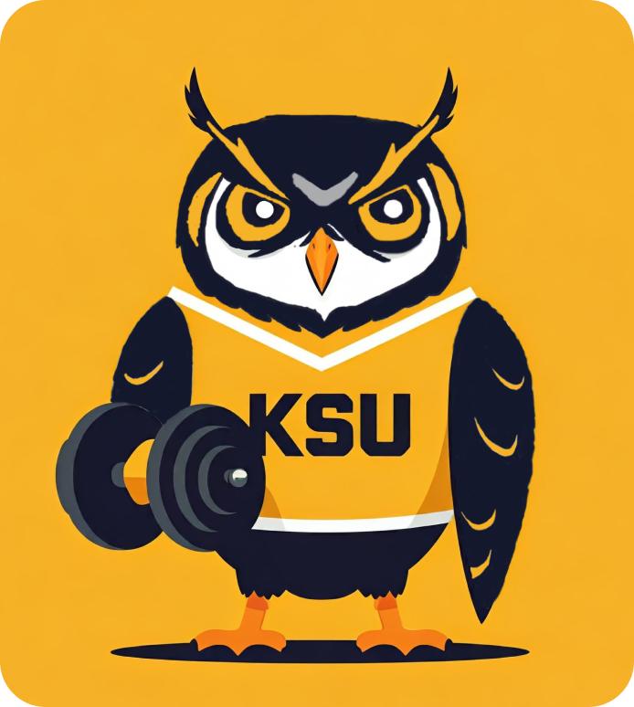

<!-- Improved compatibility of back to top link: See: https://github.com/othneildrew/Best-README-Template/pull/73 -->
<a id="readme-top"></a>

[![Contributors][contributors-shield]][contributors-url]
[![Forks][forks-shield]][forks-url]
[![Stargazers][stars-shield]][stars-url]
[![Issues][issues-shield]][issues-url]
[![MIT License][license-shield]][license-url]
[![LinkedIn][linkedin-shield]][linkedin-url]


<br />
<div align="center">
  <a href="https://github.com/dennisegonzalez/ksu-rec-center-app">
    
  </a>

  <h3 align="center">KSU Rec Center Application</h3>

  <p align="center">
    A student developed redesign of KSU's recreational center application
    <br />
    <a href="https://github.com/othneildrew/Best-README-Template"><strong>Explore the docs »</strong></a>
    <br />
    <br />
    <a href="https://github.com/othneildrew/Best-README-Template">View Demo</a>
    ·
    <a href="https://github.com/othneildrew/Best-README-Template/issues/new?labels=bug&template=bug-report---.md">Report Bug</a>
    ·
    <a href="https://github.com/othneildrew/Best-README-Template/issues/new?labels=enhancement&template=feature-request---.md">Request Feature</a>
  </p>
</div>


<!-- TABLE OF CONTENTS -->
<details>
  <summary>Table of Contents</summary>
  <ol>
    <li>
      <a href="about-this-project">About This Project</a>
      <ul>
        <li><a href="#purpose">Purpose</a></li>
	<li><a href="#scope">Scope</a></li>
	<li><a href="#audience">Audience</a></li>
      </ul>
    </li>
    <li>
      <a href="#system-overview">System Overview</a>
      <ul>
        <li><a href="#system-purpose">System Purpose</a></li>
        <li><a href="#architecture-overview">Architecture Overview</a></li>
	<li><a href="#key-components">Key Components</a></li>
      </ul>
    </li>
    <li><a href="#features">Features</a></li>
    <li><a href="#tech-stack">Tech Stack</a></li>
    <li><a href="#installation">Installation</a></li>
    <li><a href="#contributing">Contributing</a></li>
    <li><a href="#usage">Usage</a></li>
    <li><a href="#project-team">Project Team</a></li>
    <li><a href="#contact">Contact</a></li>
  </ol>
</details>


# :book: About This Project


### Purpose

This project focuses on redesigning the KSU Rec Center app to enhance user experience and maximize accessibility. The current app lacks modern design and usability, leading to a decline in usage. Our redesigned app aims to address these issues with a clean, user-friendly interface that simplifies navigation and interaction.

### Scope 

The redesigned app will include features such as personal profiles, event registrations, facility information (maps and hours), and form submissions. It will be developed using modern technologies like React Native, with a secure backend to manage data and integrate APIs for real-time scheduling and notifications.

### Audience

The app is designed for KSU students, faculty, and staff who frequently use the Rec Center facilities and seek a seamless way to interact with the services offered by the center.

<p align="right">(<a href="#readme-top">back to top</a>)</p>


# :computer: System Overview

### System Purpose

The goal of the new KSU Rec Center app is to provide a modern platform for users to easily access and engage with Rec Center services.

### Architecture Overview

The app follows a client-server architecture where the mobile app serves as the client and interacts with a secure backend server that manages data and business logic.

<details>
 <summary>Key Components</summary>
  <ol>
    <li>
      <a>Client (Mobile App):</a>
      <ul>
	<li><a>Developed using React Native for cross-platform functionality (iOS/Android).</a></li>
        <li><a>Users can register, log in, view events, and access Rec Center information.</a></li>
	<li><a>Includes features like form submissions, event registration, and facility maps.</a></li>
      </ul>
    </li>
    <li>
      <a>Backend Server:</a>
      <ul>
        <li><a>Manages user authentication, profile data, event handling, and facility information.</a></li>
        <li><a>Integrates with third-party APIs for real-time scheduling, notifications, and maps.</a></li>
	<li><a>Ensures secure communication with KSU’s cybersecurity protocols.</a></li>
      </ul>
    </li>
    <li>
      <a>Database:</a>
      <ul>
        <li><a>Stores user data, event information, and facility details securely.</a></li>
      </ul>
    </li>
  </ol>
</details>


<p align="right">(<a href="#readme-top">back to top</a>)</p>


# Features

### User Management:

| Name                              | Description                                                   |  
| --------------------------------- | ------------------------------------------------------------- | 
| Account Creation                  | Users can sign up using their Owl Express credentials.        | 
| User Authentication               | Secure login with KSU’s DUO two-factor authentication.        |
| Profile Management                | Users can edit their personal profiles and track activity.    |

### Event Management:

| Name                              | Description                                                                  |  
| --------------------------------- | ---------------------------------------------------------------------------- | 
| Event Listings                    | View upcoming events with details like date, time, and location.             | 
| Event Registration                | Register for events, receive notifications, and manage registrations.        |

### Facility Information:

| Name                              | Description                                                                  |  
| --------------------------------- | ---------------------------------------------------------------------------- | 
| Operating Hours                   | View hours for KSU’s Marietta and Kennesaw campus Rec Centers.               | 
| Maps                              | Interactive maps with descriptions of Rec Center facilities and features.    |

### Feedback and Support:

| Name                              | Description                                                                  |  
| --------------------------------- | ---------------------------------------------------------------------------- | 
| Comment Card                      | Submit feedback with a thumbs-up/thumbs-down rating and comments.            |

### User Notifications:

| Name                              | Description                                                                  |  
| --------------------------------- | ---------------------------------------------------------------------------- | 
| In-App Notifications              | Receive updates on events, classes, and important alerts.                    |

### Admin and Staff Roles:

| Name                              | Description                                                                                                  |  
| --------------------------------- | ------------------------------------------------------------------------------------------------------------ | 
| General Users                                       | Can manage profiles, access facility information, register for events, and submit forms.   | 
| Admins, Event Coordinators, and Facility Managers   | Manage content, update facility info, and monitor user feedback and activity.              |

<p align="right">(<a href="#readme-top">back to top</a>)</p>


# :link: Tech Stack

[![React][React.js]][React-url]  
 Frontend: React Native (cross-platform development for iOS and Android).
### Backend 
Node.js, Express, Firebase for authentication, KSU API for data management.
### Database
MongoDB for secure storage of user profiles, events, and facility details.
### APIs
Integration with third-party services for maps and notifications (e.g., Google Maps API).
### Version Control
GitHub for code collaboration and version management.

<p align="right">(<a href="#readme-top">back to top</a>)</p>


# Installation

1. Get a free API Key at [https://example.com](https://example.com)
2. Clone the repo
   ```sh
   git clone https://github.com/dennisegonzalez/ksu-rec-center-app.git
   ```
3. Install NPM packages
   ```sh
   npm install
   ```
4. Enter your API in `config.js`
   ```js
   const API_KEY = 'ENTER YOUR API';
   ```
5. Change git remote url to avoid accidental pushes to base project
   ```sh
   git remote set-url origin dennisegonzalez/ksu-rec-center-app
   git remote -v # confirm the changes
   ```
<p align="right">(<a href="#readme-top">back to top</a>)</p>


## Contributing

If you have a suggestion that would make this better, please fork the repo and create a pull request. You can also simply open an issue with the tag "enhancement".
Don't forget to give the project a star! Thanks again!

1. Fork the Project
2. Create your Feature Branch (`git checkout -b feature/AmazingFeature`)
3. Commit your Changes (`git commit -m 'Add some AmazingFeature'`)
4. Push to the Branch (`git push origin feature/AmazingFeature`)
5. Open a Pull Request

<p align="right">(<a href="#readme-top">back to top</a>)</p>


# :iphone: Usage

Once the app is running, users can:

	•	Register for and manage events.
	•	Access interactive maps for navigation.
	•	Submit forms and feedback.
	•	View gym hours and receive real-time notifications.

For more detailed instructions, refer to the [User Guide](link to user guide).

<p align="right">(<a href="#readme-top">back to top</a>)</p>


#  Project Team

This project is licensed under the MIT License. See the LICENSE file for more details.

## Contact

For any questions, reach out to the project team:

	•	Project Manager: [Dennise Gonzalez] (your.email@kennesaw.edu)
	•	GitHub Repository: https://github.com/dennisegonzalez/ksu-rec-center-app

<p align="right">(<a href="#readme-top">back to top</a>)</p>


<!-- MARKDOWN LINKS & IMAGES -->
<!-- https://www.markdownguide.org/basic-syntax/#reference-style-links -->
[contributors-shield]: https://img.shields.io/github/contributors/dennisegonzalez/ksu-rec-center-app.svg?style=for-the-badge
[contributors-url]: https://github.com/dennnisegonzalez/ksu-rec-center-app/graphs/contributors
[forks-shield]: https://img.shields.io/github/forks/dennisegonzalez/ksu-rec-center-app.svg?style=for-the-badge
[forks-url]: https://github.com/dennisegonzalez/ksu-rec-center-app/network/members
[stars-shield]: https://img.shields.io/github/stars/dennisegonzalez/ksu-rec-center-app.svg?style=for-the-badge
[stars-url]: https://github.com/dennisegonzalez/ksu-rec-center-app/stargazers
[issues-shield]: https://img.shields.io/github/issues/dennisegonzalez/ksu-rec-center-app.svg?style=for-the-badge
[issues-url]: https://github.com/dennisegonzalez/ksu-rec-center-app/issues
[license-shield]: https://img.shields.io/github/license/dennisegonzalez/ksu-rec-center-app.svg?style=for-the-badge
[license-url]: https://github.com/dennisegonzalez/ksu-rec-center-app/blob/master/LICENSE.txt
[linkedin-shield]: https://img.shields.io/badge/-LinkedIn-black.svg?style=for-the-badge&logo=linkedin&colorB=555
[linkedin-url]: https://linkedin.com/in/othneildrew
[product-screenshot]: images/screenshot.png
[Next.js]: https://img.shields.io/badge/next.js-000000?style=for-the-badge&logo=nextdotjs&logoColor=white
[Next-url]: https://nextjs.org/
[React.js]: https://img.shields.io/badge/React-20232A?style=for-the-badge&logo=react&logoColor=61DAFB
[React-url]: https://reactjs.org/
[Vue.js]: https://img.shields.io/badge/Vue.js-35495E?style=for-the-badge&logo=vuedotjs&logoColor=4FC08D
[Vue-url]: https://vuejs.org/
[Angular.io]: https://img.shields.io/badge/Angular-DD0031?style=for-the-badge&logo=angular&logoColor=white
[Angular-url]: https://angular.io/
[Svelte.dev]: https://img.shields.io/badge/Svelte-4A4A55?style=for-the-badge&logo=svelte&logoColor=FF3E00
[Svelte-url]: https://svelte.dev/
[Laravel.com]: https://img.shields.io/badge/Laravel-FF2D20?style=for-the-badge&logo=laravel&logoColor=white
[Laravel-url]: https://laravel.com
[Bootstrap.com]: https://img.shields.io/badge/Bootstrap-563D7C?style=for-the-badge&logo=bootstrap&logoColor=white
[Bootstrap-url]: https://getbootstrap.com
[JQuery.com]: https://img.shields.io/badge/jQuery-0769AD?style=for-the-badge&logo=jquery&logoColor=white
[JQuery-url]: https://jquery.com 
[Github.com]: https://img.shields.io/badge/Github-000000?style=for-the-badge&logo=github&logoColor=white
